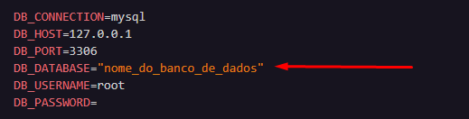

# PRECIFICAR API

## Configuração Inicial

1. Instalar dependências

    ```bash
    composer install
    ```

2. Configurar o Ambiente

    ```bash
    cp .env.example .env  
    ```

3. Definir o Banco de dados

    No arquivo .env que foi criado, atualize as configurações do banco de dados, fornecendo o nome do banco de dados desejado, usuário, senha e outras informações relevantes.

    

4. Migrar o Banco de Dados

    ```bash
    php artisan migrate 
    ```

5. Povoar o Banco de Dados

    ```bash
    php artisan db:seed --class=UsersTableSeeder
    ```

6. Para tornar a pasta storage pública

    ```bash
    php artisan storage:link
    ```

## Iniciando o Servidor PHP 

Para iniciar o servidor PHP usando o Artisan e torná-lo acessível em todas as interfaces de rede, siga estas etapas:

1. Abra um terminal no diretório do seu projeto Laravel.

2. Execute o seguinte comando:

    ```bash
    php artisan serve --host=0.0.0.0
    ```

3. O servidor será iniciado e estará acessível em todas as interfaces de rede.

4. Você pode acessar seu aplicativo Laravel a partir de outros dispositivos na mesma rede usando o endereço IP da máquina que está executando o servidor PHP e a porta padrão `8000`. Por exemplo:

    ```bash
    http://SEU_ENDERECO_IP:8000
    ```

Lembre-se de substituir `SEU_ENDERECO_IP` pelo endereço IP real da máquina que está executando o servidor PHP.

## Renderizar imagem do story do usuário

**Endpoint:** `GET /storage/stories-images/{image}`

**Descrição:**

Esta rota permite obter uma imagem de um story específico. O parâmetro `{image}` no final do endpoint representa o nome do arquivo de imagem desejado. Ao acessar este endpoint, a imagem correspondente será retornada.

**Exemplo de Uso:**

```http
GET /storage/stories-images/nome_da_imagem.jpg
```

## Recuperar a lista de stories dos usuários.

**Endpoint:** `GET /api/users/following/{id}`

**Descrição:**

Esta rota retorna o usuário atual e uma lista de usuários que são seguidos por ele. A lista inclui apenas usuários que têm histórias ativas (não expiradas). Os usuários na lista são ordenados com base na data de criação da história mais recente de cada usuário.

**Parâmetros:**
- `user_id` : O ID do usuário para o qual os stories serão recuperados.

**Exemplo de Uso:**
```http
GET /api/users/following/1
```

**Resposta de Exemplo**

```http
{
  "current_user": {
    "id": 1,
    "name": "Usuário Atual",
  },
  "users": [
    {
      "id": 2,
      "name": "Usuário 1",
    },
    // Outros users...
  ]
}
```

## Obter Stories de um suário

**Endpoint:** `GET /api/users/stories/{id}`

**Descrição:**
Esta rota é responsável por obter os stories de um usuário específico com base no `id`. Retorna uma lista dos stories do usuário, filtrados por aqueles que ainda não expiraram.

**Parâmetros:**
- `user_id` : O ID do usuário para o qual os stories serão recuperados.

**Exemplo de Uso:**
```http
GET /api/users/stories/1
```

**Resposta de Exemplo**

```http
{
  "stories": [
    {
      "id": 1,
      "user_id": 1,
      "path_image_story": "story1.jpg",
      "subtitle_story": "Lorem ipsum...",
      "expiration_date": "2023-11-20 12:00:00",
      "created_at": "2023-11-18 08:30:00",
      "updated_at": "2023-11-18 08:30:00"
    },
    // Outros stories...
  ]
}
```

## Upload de story

**Endpoint:** `POST /api/users/stories`

**Descrição:**

Esta rota permite que os usuários façam upload do seu story por meio do envio de uma imagem. A imagem é salva no sistema de arquivos, e as informações do story são registradas no banco de dados.

**Parâmetros:**
- `user_id` (body): O ID do usuário que está fazendo o upload.
- `image` (arquivo): A imagem a ser enviada.

**Exemplo de Uso:**
```http
POST /api/users/stories
```

**Resposta de Exemplo**

```http
{
  "message": "Upload do story foi concluído com sucesso!"
}
```
## getUsersList Endpoint

**Endpoint:** `GET /api/users/list/{id}`

**Descrição:**

Esta rota obtém a lista de usuários que estão sendo seguidos e não seguidos por um usuário específico.

**Parâmetros:**
- `id` (parâmetro de rota): O ID do usuário para o qual você deseja obter a lista.

**Exemplo de Uso:**
```http
GET /api/users/list/1
```

**Resposta de Exemplo**

A resposta será um JSON contendo uma lista de usuários com informações sobre se estão sendo seguidos ou não. Cada usuário terá os seguintes campos:

- `id`: O ID do usuário.
- `name`: O nome do usuário.
- `following`: Um indicador booleano que indica se o usuário está sendo seguido pelo usuário específico.


```http
[
  {
    "id": 1,
    "name": "Usuário Seguido",
    "following": true
  },
  {
    "id": 2,
    "name": "Usuário Não Seguido",
    "following": false
  },
  // ... outros usuários
]
```
